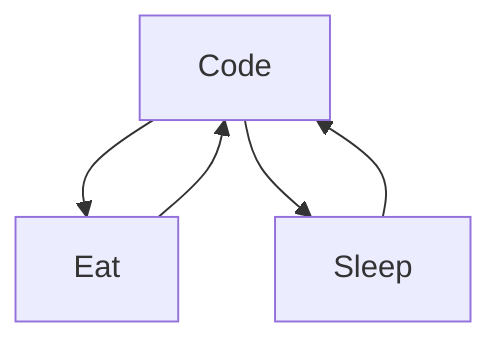

<!--
**Bastien repo** is a ✨ _special_ ✨ repository because its `README.md` (this file) appears on your GitHub profile.
-->

# Bastien VDB
React JS developer specializing in front with back knowledges. Worked as a consultant at Accenture for 7 years, collaborating with companies like L'Oréal and Safran. Freelancing for the past 2 years. Passionate about building modern, responsive interfaces. Available for collaborations.

### I Worked for

  ✨   
  ✨   
  ✨   
  ✨

  

### Now:

- 💬 Ask me about everything about Web developpment, I'll be more than happy to talk about it
- 📫 How to reach me: @Email or ->Linkedin
            
- ⚡ Fun fact: I started to learn code quite young at 13 like Bill, and also in my car garage but ....

  

### Connect with me:
My website: https://bastiendeboisrolin.info/
&nbsp;&nbsp;
My Linkekin: https://www.linkedin.com/in/bastien-vermot-de-boisrolin-10051a72/

  

### Languages and Tools:  

  

  
[website]: https://bastiendeboisrolin.info/
[Linkedin]: https://www.linkedin.com/in/bastien-vermot-de-boisrolin-10051a72/
